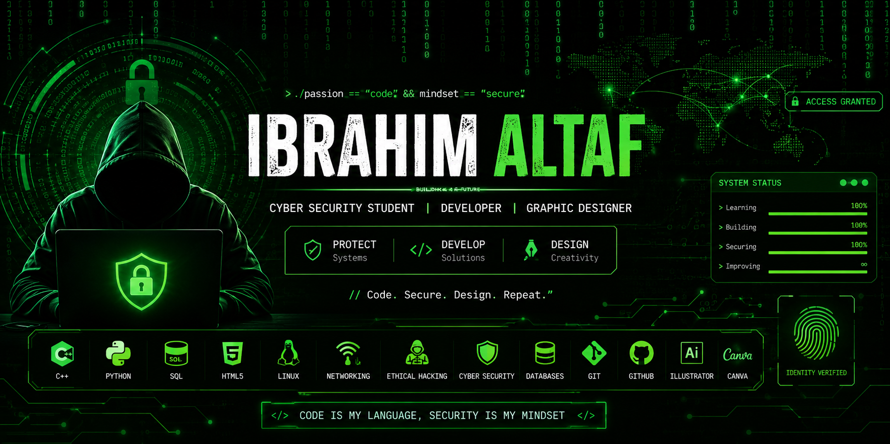

  

<h1 align="center">Hi 👋, I'm Ibrahim Altaf</h1>

  

## 🛡️ About Me

🎓 BS Cyber Security Student

💻 Passionate about:
- Cyber Security
- Software Development
- Networking
- Graphic Design

🚀 Currently Working On:
- Healthcare Appointment System (C++)
- Student Portal System
- GitHub Portfolio

🌱 Currently Learning:
- Python
- SQL
- Linux
- Ethical Hacking Fundamentals
<!--
**IbrahimAltaf78/IbrahimAltaf78** is a ✨ _special_ ✨ repository because its `README.md` (this file) appears on your GitHub profile.

Here are some ideas to get you started:

- 🔭 I’m currently working on ...
- 🌱 I’m currently learning ...
- 👯 I’m looking to collaborate on ...
- 🤔 I’m looking for help with ...
- 💬 Ask me about ...
- 📫 How to reach me: ...
- 😄 Pronouns: ...
- ⚡ Fun fact: ...
-->
